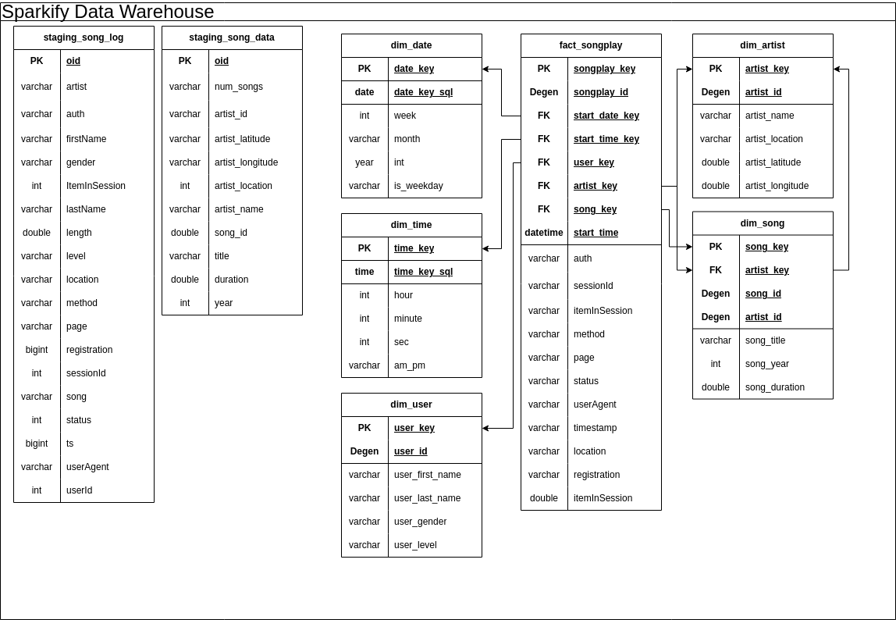

# Udacity Project - Sparkify Data Warehouse

# Introduction

This project builds a cloud-based data warehouse for Sparkify, a music streaming company, to enable advanced analytics of user activity. The warehouse is implemented using Amazon Redshift and designed with a star schema for efficient querying. The goal is to process and analyze large datasets containing user behavior and song metadata to provide actionable insights for Sparkify's business.

# Key Deliverables
- A star schema optimized for analytical queries.
- An ETL pipeline that extracts data from S3, transforms it, and loads it into Redshift.
    
## Table of Contents
- [Introduction](#introduction)
- [Part 1 - Data Warehouse Design](#part-1---data-warehouse-design)
  - [Step 1 - Inspect the Data](#step-1---inspect-the-data)
  - [Step 2 - Star Schema Design](#step-2---star-schema-design)
  	- [Data Warehouse Best Practices](#data-warehouse-best-practices)
  	- [Redshift Best Practices](#redshift-best-practices)
  	- [Final Design](#final-design)
- [Part 2 - Extract Transform Load (ETL) Design](#part-2---extract-transform-load-etl-design)
- [Part 3 - Set up and Execute](#part-3---set-up-and-execute)
- [Potential Improvements](#potential-improvements)
  - [Data Design](#data-design)
  - [Performance](#performance)
  - [Infrastructure](#infrastructure)
- [Rubric for Project](#rubric-for-project)


# Part 1 - Data Warehouse Design

Before starting this project, we need to see what data we have and what we are asked to find.  Data warehouses are built to facilitate answering business users' questions.  Some of these questions may be unknown to the user at the time of development.  Therefore, it's important to select the appropriate grain for our fact table and make sure that we have conforming dimension tables.  In this project, it is fairly straightforward since we are given a single fact of song plays as our grain. 

## Step 1 - Inspect the Data

The data reside in "s3://udacity-dend/song_data" (song_data) and "s3://udacity-dend/log_data" (log_data)

**Song Data**
*The first dataset is a subset of real data from the Million Song Dataset(opens in a new tab). Each file is in JSON format and contains metadata about a song and the artist of that song. The files are partitioned by the first three letters of each song's track ID. For example, here are file paths to two files in this dataset.*

An example song is: *{"num_songs": 1, "artist_id": "ARJIE2Y1187B994AB7", "artist_latitude": null, "artist_longitude": null, "artist_location": "", "artist_name": "Line Renaud", "song_id": "SOUPIRU12A6D4FA1E1", "title": "Der Kleine Dompfaff", "duration": 152.92036, "year": 0}*

So, we have the following properties in song_data with my estimated data types:

| property         | Data Type  |
|----------------------|-----------|
| num_songs           | int       |
| artist_id           | varchar   |
| artist_latitude     | double    |
| artist_longitude    | double    |
| artist_location     | varchar   |
| artist_name         | varchar   |
| song_id             | varchar   |
| title               | varchar   |
| duration            | double    |
| year                | int       |


**Log Data**

*The second dataset consists of log files in JSON format generated by this event simulator(opens in a new tab) based on the songs in the dataset above. These simulate app activity logs from an imaginary music streaming app based on configuration settings.*

*The log files in the dataset you'll be working with are partitioned by year and month. For example, here are file paths to two files in this dataset.*


| Column Name       | Data Type                           |
|-------------------|-------------------------------------|
| artist            | Varchar                            |
| auth              | Varchar                            |
| firstName         | Varchar                            |
| gender            | Varchar                            |
| itemInSession     | int                                |
| lastName          | Varchar                            |
| length            | double                             |
| level             | Varchar                            |
| location          | Varchar                            |
| method            | Varchar                            |
| page              | Varchar                            |
| registration      | bigint                             |
| sessionId         | int                                |
| song              | Varchar                            |
| status            | int                                |
| ts                | datetime (Unix timestamp in ms)    |
| userAgent         | Varchar                            |
| userId            | int                                |

## Step 2 - Star Schema Design

The project instructions call for the following tables to be includes the following tables:

|Table | Table Type|Columns|
|-----|-----|----|
|songplays|fact|songplay_id, start_time, user_id, level, song_id, artist_id, session_id, location, user_agent|
|users|dimension|user_id, first_name, last_name, gender, level|
|songs|dimension|song_id, title, artist_id, year, duration|
|artists|dimension|artist_id, name, location, latitude, longitude|
|time|dimension|start_time, hour, day, week, month, year, weekday|

### Data Warehouse Best Practices

Before going further, there are some changes we need to make for data warehouse best practices:

1.  Table names should be singular for clarity, simplicity, and consistency.  This is a general best practice for database design.
2.  Using natural keys like song_id, user_id, artist_id from the source data as a primary keys in the data warehouse is not a good idea.  We need to implement surrogate keys (system generated keys) in the data warehouse as a best practice.  This future proofs the schema in case of new data sources, software updates, etc.  We will keep the natural keys in the data as degenerate keys for reference.
3.  The time dimension should be split into separate date and time dimensions. The data contain unix timestamps with milliseconds.  The time table could get unreasonably large if we left it as a datetime.  If we were to actually populate the time dimension using the datetime, it would have 86,400,000 ms per day!  This is not sustainable.  We will drop the ms values and have 86,400 rows in the time and start with 10 years in the date table. This is roughly 3652 rows depending on leap days.  **We will pre-populate these tables.**
4.  The location properties need to be named according to what they are assigned.  i.e. artist_location, and songplay_location.  This avoids ambiguity for the business user.
5.  Degenerate natural keys won't be included in the songplay fact table as they are in the dimension tables.
6.  Level will be in the user dimension only since it is not a measure but rather an attribute of the user.  If we wanted, we could chane the user dimension to a slowly changing dimension where we have effective datetimes. This might be beneficial if we wanted to know something about the user before and after they signed up for service.  But that does not appear to be necessary at this time.
7.  Indicator columns like is_weekday or am_pm will contain the text "Weekday" or "Weekend" and "AM" or "PM" respectively and not Boolean True or False.  This is a data warehouse best practice since the goal is for ease of use of the business user.

These changes ensure that the data warehouse is stable, efficient, and follows data warehouse best practices.

### Redshift Best Practices
Now that we have the data warehouse best practices, let's take a look at Redshift best practices: [Redshift Best Practices](https://docs.aws.amazon.com/redshift/latest/dg/c_designing-tables-best-practices.html)

1.  **Sort Keys** - we need to pick a sort key since that is how Redshift stores data on disk and how the query optimizer works.
    - The option to use the join column as a sort key on most of the table seems appropriate since the queries we'll be doing have several joins on the fact table.  However, in the interest of time on this project, I'll select the `AUTO` option.
2.  **Distribution Style** - From the AWS help file: When you run a query, the query optimizer redistributes the rows to the compute nodes as needed to perform any joins and aggregations. The goal in selecting a table distribution style is to minimize the impact of the redistribution step by locating the data where it needs to be before the query is run.
    - Since I am using `AUTO` optimization, I don't need to do anything here.
3. **Automatic Compression** - ENCODE AUTO is the default and we will leave it that way.
4. **Design Constraints** - Redshift doesn't actually use the constraints on tables for anything other than information.  [Redshift Table Constraints](https://docs.aws.amazon.com/redshift/latest/dg/t_Defining_constraints.html)
5. **Use Smallest possible column size** - This affects definitions for the `VARCHAR` type.  We want to use an appropriate size for every `VARCHAR` column.  Since we do not know what we have in the source data and the source data takes 3.5 hours to load, we will leave many of the VARCHAR as is.
6. **Use Date/Time data types for date columns** - We will need to use this in our date and time tables when we insert from the staging tables.

### Final Design

Below is my design for the star schema:



Notes about Redshift
- Redshift does not support typical upsert operations. We need to utilize another strategy, Manifests.

# Part 2 - Extract Transform Load (ETL) Design

Now that we have the initial design for the staging tables and star schema for our data warehouse, it's time to plan the ETL process. One of the key considerations of an ETL process is that we only perform incremental loading.  Incremental loading ensures that only new or updated data is processed during ETL runs, which optimizes performance and reduces redundant processing.

We'll follow along with *some* of the [Redshift Data Loading Best Practices](https://docs.aws.amazon.com/redshift/latest/dg/c_loading-data-best-practices.html)

1.  COPY command.  Since we're extracting data from S3, we will use the COPY command to load data into our staging tables.  It is much more efficient than INSERT commands.
2.  Verify data files before and after a load - We'll use a manifest file to ensure that we're loading the proper files.  After the load we can verify which files were committed using the system tables.  Then we will update the manifest.


# Part 3 - Set up and Execute

**Step 1:** Execute the cloud formation template

Since we're only allotted a small amount of money for this project in udacity, I will use a cloud formation template to build and tear down the infrastructure.  This is a best practice anyway.  I will create the stack on us-west-2 where the data for songs S3 bucket is located. Once you create the stack, navigate to the outputs section.  You will use this in the next step.

[Cloud Formation Template](redshift_iac.yaml)

**Step 2:** Fill out the config file: 

Next we need to fill in the variables in our config file so that we can begin populating the database.  You should still have the cloud formation up.  Navigate to the outputs and begin filling out the following file

[config file](dwh.cfg)

`HOST` - This is the `Cluster Endpoint` should look like my-redshift-cluster.xxxxxxxxxxx.us-west-2.redshift.amazonaws.com/

`DB_PASSWORD` - this is the password you provided in the cloud formation

`ARN` - This is the ARN for the IAM role the cloud formation template created.  Something like arn:aws:iam::xxxxx:role/redshift-stack-RedshiftS3AccessRole-xxxxx

`MANIFEST_BUCKET` - This is the bucket name for the bucket you created in the cloud formation template.

**Step 3:**

Upload the following files to the s3 bucket you created in the previous step, `MANIFEST_BUCKET`, :
[file 1](data/log_jsonpath.json)
[file 2](data/song_data_paths.json)

These files tell Redshift how to read the json files when we use the COPY command.

**Step 4:** Create the tables

Run the file that creates the tables in the database.  [create_database](create_tables.py)

e.g. `python create_tables.py`

This script automates the process of managing Redshift tables and populating
date-time tables for the ETL pipeline. It performs the following tasks:
1. Drops existing tables in Redshift (if they exist).
2. Creates new tables in Redshift.
3. Populates date-time tables and uploads them to S3 for further use.
4. Logs information in `logs/create_tables.log`

Note that the user that you created will need access to write to your S3 Manifest bucket that we created.

Inspect the log file to make sure that all the tables were created: [create_tables_log](logs/create_tables.log)

**Step 5:** Run the ETL (This step takes approximately 3.5 hours)

Run the file that performs the ETL, [ETL Script](etl.py)

e.g. `python etl.py`

This module automates the process of:
1. Generating manifest files for new S3 files not yet loaded into Redshift.
2. Extracting data from S3 into Redshift staging tables.
3. Loading data into the star schema tables from the staging tables.
4. Truncating staging and star schema tables for debugging purposes.
5. Logs information to `logs/etl.log`

Inspect the logs to make sure that the data was inserted into the warehouse: [ETL log](logs/etl.log)

**Step 6:** Run some queries on the data.

You can run some queries on the database to see what we've done.
[Query Script](query_db.py)

e.g. `python query_db.py`

The script includes predefined queries for analyzing song plays and
top songs during weekends.

Below is sample output for the queries.  

Console Output
```
Query: SELECT COUNT(*) from staging_song_log -> Count: 8056
Query: SELECT COUNT(*) FROM staging_song_data -> Count: 385251
Query: SELECT COUNT(*) FROM dim_user -> Count: 104
Query: SELECT COUNT(*) FROM dim_artist -> Count: 45266
Query: SELECT COUNT(*) FROM dim_song -> Count: 387367
Query: SELECT COUNT(*) FROM fact_songplay -> Count: 13549
Query: SELECT COUNT(*) FROM dim_time -> Count: 86400
Query: SELECT COUNT(*) FROM dim_date -> Count: 4018
  is_weekday   song_title   artist_name  songplay_count
0    Weekday     Stronger    Kanye West             160
1    Weekend  Greece 2000  Three Drives              48
  am_pm  song_plays
0    AM        1056
1    PM        1603
```


# Potential Improvements

## **Data Design**
1. **Slowly Changing Dimension for Users**:
   - Convert the user table into a Slowly Changing Dimension (SCD) by adding effective dates. This allows tracking changes in user attributes, such as their subscription level, over time.
   - **Benefit**: Provides a historical view of user behavior, enabling more detailed analysis.

2. **Combine Songplay Information**:
   - Consolidate songplay information into a single JSON file per day instead of individual records.
   - **Benefit**: Reduces processing time during ETL by limiting the number of files processed.

3. **Fix Source Data Encoding**:
   - Standardize encoding for special characters in the source data to ensure consistent formatting across all tables.
   - **Benefit**: Improves data quality and avoids errors when querying or transforming data.

## **Performance**
1. **Optimize Manifest Files**:
   - Enhance the manifest creation process to dynamically include only the necessary files for incremental loading.
   - **Benefit**: Reduces unnecessary file scans and improves loading performance.

2. **Use Efficient Data Types**:
   - Review `VARCHAR` column sizes and limit them to realistic lengths.
   - **Benefit**: Saves disk space and improves query performance in Redshift.

## **Infrastructure**
- **Reduce Costs with Free-Tier RDS**:
   - Use a free-tier RDS database instead of Redshift for smaller datasets.
   - This only applies if the data are going to be small.
   - **Benefit**: Reduces infrastructure costs while maintaining sufficient performance for this project.
 
# Rubric for Project

Below is the grading rubric for the project. 
The provided code adheres strictly to PEP8 and PEP257 guidelines. 
While this level of compliance is often unnecessary for many projects, 
it serves as a demonstration of best practices in coding standards.
 

**Table Creation**

| **Criteria**                             | **Submission Requirements**                                                                                     |
|------------------------------------------|-----------------------------------------------------------------------------------------------------------------|
| Table creation script runs without errors. | The script, `create_tables.py`, runs in the terminal without errors. The script successfully connects to the Sparkify database, drops any tables if they exist, and creates the tables. |
| Staging tables are properly defined.     | `CREATE` statements in `sql_queries.py` specify all columns for both the songs and logs staging tables with the right data types and conditions. |
| Fact and dimensional tables for a star schema are properly defined. | `CREATE` statements in `sql_queries.py` specify all columns for each of the five tables with the right data types and conditions. |
	
**ETL**

| **Criteria**                             | **Submission Requirements**                                                                                     |
|------------------------------------------|-----------------------------------------------------------------------------------------------------------------|
| ETL script runs without errors.          | The script, `etl.py`, runs in the terminal without errors. The script connects to the Sparkify Redshift database, loads `log_data` and `song_data` into staging tables, and transforms them into the five tables. |
| ETL script properly processes transformations in Python. | `INSERT` statements are correctly written for each table and handle duplicate records where appropriate. Both staging tables are used to insert data into the `songplays` table. |

**Code Quality**
| **Criteria**                             | **Submission Requirements**                                                                                     |
|------------------------------------------|-----------------------------------------------------------------------------------------------------------------|
| The project shows proper use of documentation. | The `README` file includes a summary of the project, how to run the Python scripts, and an explanation of the files in the repository. Comments are used effectively, and each function has a docstring. |
| The project code is clean and modular.   | Scripts have an intuitive, easy-to-follow structure with code separated into logical functions. Naming for variables and functions follows the PEP8 style guidelines. |
