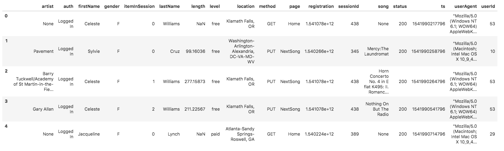

# Udacity Project - Sparkify Data Warehouse
Note: text in italic font is from the project instructions on udacity.

# Introduction 

*A music streaming startup, Sparkify, has grown their user base and song database and want to move their processes and data onto the cloud. Their data resides in S3, in a directory of JSON logs on user activity on the app, as well as a directory with JSON metadata on the songs in their app.*

*As their data engineer, you are tasked with building an ETL pipeline that extracts their data from S3, stages them in Redshift, and transforms data into a set of dimensional tables for their analytics team to continue finding insights into what songs their users are listening to.*

# Part 1 - Data Warehouse Design

Before starting this project, we need to see what data we have and what we are asked to find.  Data warehouses are built to facilitate answering business users' questions.  Some of these questions may be unknown to the user at the time of development.  Therefore, it's important to select the appropriate grain for our fact table and make sure that we have conforming dimension tables.  In this project, it is fairly straightforward since we are given a single fact of song plays as our grain. 

## Step 1 - Inspect the Data

The data reside in "s3://udacity-dend/song_data" (song_data) and "s3://udacity-dend/log_data" (log_data)

**Song Data**
*The first dataset is a subset of real data from the Million Song Dataset(opens in a new tab). Each file is in JSON format and contains metadata about a song and the artist of that song. The files are partitioned by the first three letters of each song's track ID. For example, here are file paths to two files in this dataset.*

An example song is: *{"num_songs": 1, "artist_id": "ARJIE2Y1187B994AB7", "artist_latitude": null, "artist_longitude": null, "artist_location": "", "artist_name": "Line Renaud", "song_id": "SOUPIRU12A6D4FA1E1", "title": "Der Kleine Dompfaff", "duration": 152.92036, "year": 0}*

So, we have the following properties in song_data with my estimated data types:

| property         | Data Type  |
|----------------------|-----------|
| num_songs           | int       |
| artist_id           | varchar   |
| artist_latitude     | double    |
| artist_longitude    | double    |
| artist_location     | varchar   |
| artist_name         | varchar   |
| song_id             | varchar   |
| title               | varchar   |
| duration            | double    |
| year                | int       |

**Log Data**

*The second dataset consists of log files in JSON format generated by this event simulator(opens in a new tab) based on the songs in the dataset above. These simulate app activity logs from an imaginary music streaming app based on configuration settings.*

*The log files in the dataset you'll be working with are partitioned by year and month. For example, here are file paths to two files in this dataset.*

| Column Name       | Data Type                           |
|-------------------|-------------------------------------|
| artist            | Varchar                            |
| auth              | Varchar                            |
| firstName         | Varchar                            |
| gender            | Varchar                            |
| itemInSession     | int                                |
| lastName          | Varchar                            |
| length            | double                             |
| level             | Varchar                            |
| location          | Varchar                            |
| method            | Varchar                            |
| page              | Varchar                            |
| registration      | bigint                             |
| sessionId         | int                                |
| song              | Varchar                            |
| status            | int                                |
| ts                | datetime (Unix timestamp in ms)    |
| userAgent         | Varchar                            |
| userId            | int                                |

## Step 2 - Star Schema Design

The project instructions call for the following tables to be includes the following tables:

|Table | Table Type|Columns|
|-----|-----|----|
|songplays|fact|songplay_id, start_time, user_id, level, song_id, artist_id, session_id, location, user_agent|
|users|dimension|user_id, first_name, last_name, gender, level|
|songs|dimension|song_id, title, artist_id, year, duration|
|artists|dimension|artist_id, name, location, latitude, longitude|
|time|dimension|start_time, hour, day, week, month, year, weekday|

### Data Warehouse Best Practices

Before going further, there are some changes we need to make for data warehouse best practices:

1.  Table names should be singular for clarity, simplicity, and consistency.  This is a general best practice for database design.
2.  Using natural keys like song_id, user_id, artist_id from the source data as a primary keys in the data warehouse is not a good idea.  We need to implement surrogate keys (system generated keys) in the data warehouse as a best practice.  This future proofs the schema in case of new data sources, software updates, etc.  We will keep the natural keys in the data as degenerate keys for reference.
3.  The time dimension should be split into separate date and time dimensions. The data contain unix timestamps with milliseconds.  The time table could get unreasonably large if we left it as a datetime.  If we were to actually populate the time dimension using the datetime, it would have 86,400,000 ms per day!  This is not sustainable.  We will drop the ms values and have 86,400 rows in the time and start with 10 years in the date table. This is roughly 3652 rows depending on leap days.
4.  The location properties need to be named according to what they are assigned.  i.e. artist_location, and songplay_location.  This avoids ambiguity for the business user.
5.  Degenerate natural keys won't be included in the songplay fact table as they are in the dimension tables.
6.  Level will be in the user dimension only since it is not a measure but rather an attribute of the user.  If we wanted, we could chane the user dimension to a slowly changing dimension where we have effective datetimes. This might be beneficial if we wanted to know something about the user before and after they signed up for service.  But that does not appear to be necessary at this time.
7.  Indicator columns like is_weekday or am_pm will contain the text "Weekday" or "Weekend" and "AM" or "PM" respectively and not Boolean True or False.  This is a data warehouse best practice since the goal is for ease of use of the business user.

These changes ensure that the data warehouse is stable, efficient, and follows data warehouse best practices.

### Redshift Best Practices
Now that we have the data warehouse best practices, let's take a look at Redshift best practices: [Redshift Best Practices](https://docs.aws.amazon.com/redshift/latest/dg/c_designing-tables-best-practices.html)

### Final Design

Below is my design for the star schema:

Notes about Redshift
- Redshift does not support typical upsert operations. We need to utilize another strategy. Manifests
- Deduplication?

# Potential Improvements

1. Include data provenance in the database
2. Include a manifest to control which files in S3 will be inserted. https://docs.aws.amazon.com/redshift/latest/dg/verifying-that-correct-files-are-present.html
